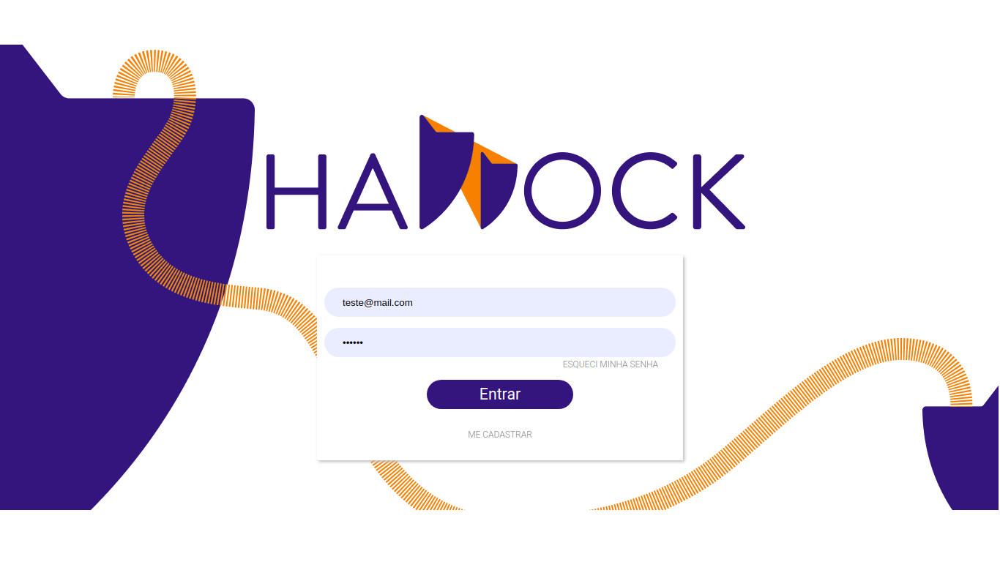

# Haddock Education
> Aplicação Web para o projeto Haddock Education.

O projeto Haddock Education é uma plataforma onde profissionais que atuam em rebocadores podem, de forma colaborativa, sanar dúvidas com relação a operações de trabalho, sejam elas críticas ou não.

> Prototipo no figma: https://www.figma.com/embed?embed_host=share&url=https%3A%2F%2Fwww.figma.com%2Ffile%2F8xqLQex5g61UWUSNaFx844%2FHaddock%3Fnode-id%3D0%253A1&chrome=DOCUMENTATION

> Video de apresentação Demo: https://www.youtube.com/watch?v=TJ5FyD_Qs20

## Autor
👤 **Vinicio Brejinski**

- Github: https://github.com/ViniDB27
- Linkedin: https://www.linkedin.com/in/vinicio-brejinski-9ab01a170/
- site: https://estudandopraburro.com.br/